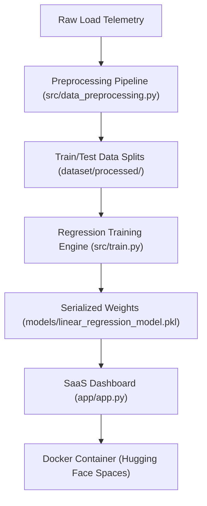

# ⚡ Volterra: Intelligent Energy Analytics Engine

[](LICENSE)
[](requirements.txt)
[](https://huggingface.co/spaces/ritesh19180/smart-electricity-consumption-predictor)
[](src/train.py)

An end-to-end machine learning platform for forecasting household electricity consumption using environmental and behavioral factors. Volterra transforms raw utility telemetry data into actionable intelligence, enabling predictive load management, cost projections, and carbon footprint tracking through a production-grade SaaS interface.

---

## 📋 Project Overview

Volterra is a production-ready predictive engine built to automate electricity consumption forecasting. Operating on optimized regression parameters, the engine ingests real-time inputs (such as local temperature, humidity, active occupant counts, and appliance runtimes) to output immediate daily load projections, cost estimations, and carbon impact metrics.

---

## 💼 Business Problem

Modern smart grids and domestic utility systems face challenges in load balancing and active conservation. Without forecasting capabilities, consumers and grid operators cannot:
*   Identify peak demand intervals before they occur, leading to high utility bills.
*   Quantify how specific behavioral changes (e.g., reducing AC runtimes by 1 hour) translate to direct cost savings.
*   Correlate occupancy and appliance runtimes with daily carbon emissions.

Volterra solves this by providing a white-box forecasting model that maps environmental and behavioral features directly to consumption metrics.

---

## 🏗️ Solution Architecture

Volterra is structured as a modular, containerized application ready for production deployment:



---

## 🚀 Key Features

*   **Real-time Load Simulator**: Interactive control panel to simulate environmental and appliance runtimes.
*   **Predictive Financial Forecasts**: Calculates daily operational costs based on current load forecasts ($0.15/kWh baseline).
*   **Carbon Footprint Tracking**: Projects daily CO₂ output (0.4kg CO₂/kWh emissions rate) to promote sustainability.
*   **Dynamic Feature Attribution**: Interactive bar charts detailing active feature contributions ($Weight \times Input$) in real time.
*   **Scenario Presets**: Sidebar load profiles (Peak Demand, Eco Conservation, Baseline Utility) for instant configuration.

---

## 📈 Model Performance & Parametrics

The forecasting engine utilizes a Linear Regression model fitted over 3,000 telemetry samples:

*   **R² Variance Score**: **94.95%** (High-predictive confidence on testing data)
*   **Mean Absolute Error (MAE)**: **6.38 kWh**
*   **Root Mean Squared Error (RMSE)**: **7.91 kWh**

### Optimization Coefficients (Impact Weights)
The model assigns the following coefficients to input variables (representing daily load shift in kWh per unit change):
*   **Occupancy**: `+8.0050`
*   **Weekend Profile**: `+5.1341`
*   **AC Operating Hours**: `+4.4470`
*   **Appliance Operating Hours**: `+2.1748`
*   **Temperature**: `+1.8166`
*   **Humidity**: `+0.2958`
*   **Intercept (Baseline Constant)**: `0.4721`

---

## 🖼️ Dashboard Preview

To view the screenshot mockups, concepts, and AI image prompts used to design this platform's visual interface, refer to [reports/screenshot_strategy.md](reports/screenshot_strategy.md).

---

## 💻 Tech Stack

*   **Core Engine**: Python 3.10
*   **Modeling & Training**: Scikit-Learn, Pandas, NumPy
*   **Visualizations**: Seaborn, Matplotlib
*   **SaaS Interface**: Streamlit
*   **Containerization & Hosting**: Docker, Hugging Face Spaces

---

## 📂 Project Structure

For a full directory tree detailing files and directories, see [PROJECT_STRUCTURE.md](PROJECT_STRUCTURE.md).

---

## 🛠️ Installation & Local Running

### 1. Clone & Install Dependencies
```bash
git clone https://github.com/ritesh-1918/smart-electricity-consumption-predictor.git
cd smart-electricity-consumption-predictor
pip install -r requirements.txt
```

### 2. Preprocess Dataset
```bash
python src/data_preprocessing.py
```

### 3. Execute Training Pipeline
```bash
python src/train.py
```

### 4. Launch SaaS Dashboard
```bash
python -m streamlit run app/app.py
```

---

## 🌐 Production Deployment

Volterra is compiled into a Docker container and hosted in production on Hugging Face Spaces.

*   **Hugging Face Spaces URL**: [huggingface.co/spaces/ritesh19180/smart-electricity-consumption-predictor](https://huggingface.co/spaces/ritesh19180/smart-electricity-consumption-predictor)

---

## 🗺️ Future Roadmap

*   **Regularization Tuning**: Incorporate Ridge and Lasso scaling to mitigate potential collinearity between humidity and temperature.
*   **Multi-Model Comparison**: Add Decision Tree Regressor diagnostics to the backend.
*   **InfluxDB Integration**: Connect telemetry inputs to a live InfluxDB stream for real-time household monitoring.

---

## 👤 Author
*   **Developer**: [ritesh-1918](https://github.com/ritesh-1918)
