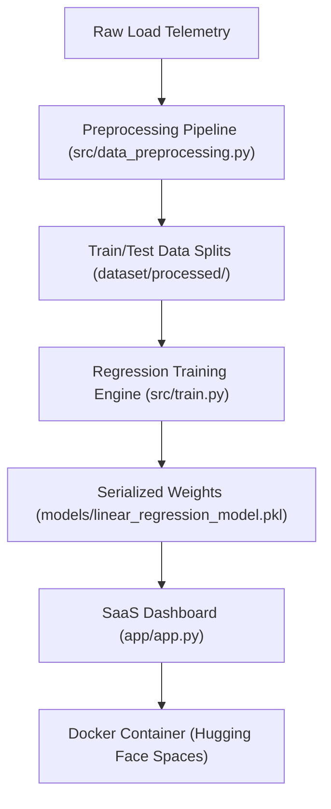

# ⚡ Volterra: Intelligent Energy Analytics Engine

<div align="center">

### 🚀 **[LIVE DEMO] Try Volterra on Hugging Face Spaces**
👉 **[LAUNCH INTERACTIVE SAAS DASHBOARD](https://huggingface.co/spaces/ritesh19180/smart-electricity-consumption-predictor)** 👈

[](https://huggingface.co/spaces/ritesh19180/smart-electricity-consumption-predictor)
[](src/train.py)
[](requirements.txt)
[](LICENSE)

</div>

> [!IMPORTANT]
> ### 🌐 **[LIVE APP DEMO]**
> Want to test the model yourself in real time? Try the live interactive web app deployed on Hugging Face:
> 👉 **[Launch Volterra on Hugging Face Spaces](https://huggingface.co/spaces/ritesh19180/smart-electricity-consumption-predictor)**
> 
> ### 📖 **[WORKSHOP PARTICIPANTS HANDOUT]**
> Deployed this project and looking for the master resource manual?
> 👉 **[All-in-One Handoff & Code Manual (COMPLETE_HANDOFF_GUIDE.md)](resources/COMPLETE_HANDOFF_GUIDE.md)**

---

## 📋 Project Overview

Volterra is a production-ready predictive engine built to automate electricity consumption forecasting. Operating on optimized regression parameters, the engine ingests real-time inputs (such as local temperature, humidity, active occupant counts, and appliance runtimes) to output immediate daily load projections, cost estimations, and carbon impact metrics.

---

## 💼 Business Problem

Modern smart grids and domestic utility systems face challenges in load balancing and active conservation. Without forecasting capabilities, consumers and grid operators cannot:
*   Identify peak demand intervals before they occur, leading to high utility bills.
*   Quantify how specific behavioral changes (e.g., reducing AC runtimes by 1 hour) translate to direct cost savings.
*   Correlate occupancy and appliance runtimes with daily carbon emissions.

Volterra solves this by providing a white-box forecasting model that maps environmental and behavioral features directly to consumption metrics.

---

## 🏗️ Solution Architecture

Volterra is structured as a modular, containerized application ready for production deployment:



---

## 🚀 Key Features

*   **Real-time Load Simulator**: Interactive control panel to simulate environmental and appliance runtimes.
*   **Predictive Financial Forecasts**: Calculates daily operational costs based on current load forecasts ($0.15/kWh baseline).
*   **Carbon Footprint Tracking**: Projects daily CO₂ output (0.4kg CO₂/kWh emissions rate) to promote sustainability.
*   **Dynamic Feature Attribution**: Interactive bar charts detailing active feature contributions ($Weight \times Input$) in real time.
*   **Scenario Presets**: Sidebar load profiles (Peak Demand, Eco Conservation, Baseline Utility) for instant configuration.

---

## 📈 Model Performance & Parametrics

The forecasting engine utilizes a Linear Regression model fitted over 3,000 telemetry samples:

*   **R² Variance Score**: **94.95%** (High-predictive confidence on testing data)
*   **Mean Absolute Error (MAE)**: **6.38 kWh**
*   **Root Mean Squared Error (RMSE)**: **7.91 kWh**

### Optimization Coefficients (Impact Weights)
The model assigns the following coefficients to input variables (representing daily load shift in kWh per unit change):
*   **Occupancy**: `+8.0050`
*   **Weekend Profile**: `+5.1341`
*   **AC Operating Hours**: `+4.4470`
*   **Appliance Operating Hours**: `+2.1748`
*   **Temperature**: `+1.8166`
*   **Humidity**: `+0.2958`
*   **Intercept (Baseline Constant)**: `0.4721`

---

## 🧮 Interactive Model Simulator (Calculate Offline!)

You don't need the web dashboard to see how our model thinks. You can calculate your household forecast manually in **30 seconds** using our learned equation:

$$\text{Daily Load (kWh)} \approx 0.47 + (1.82 \times \text{Temp}) + (0.30 \times \text{Humidity}) + (8.01 \times \text{Occupants}) + (4.45 \times \text{AC Hours}) + (2.17 \times \text{Appliance Hours}) + (5.13 \text{ if Weekend})$$

### 🏃 Try These Real-World Scenarios:

| Scenario | Temperature | Occupants | AC Hours | Appliance Hours | Day Type | Estimated Consumption |
| :--- | :---: | :---: | :---: | :---: | :---: | :---: |
| **Eco Mode (Weekday)** | 24°C | 3 | 2h | 4h | Weekday (0) | **$\approx 85.3$ kWh** |
| **Baseline Normal** | 26°C | 4 | 4h | 6h | Weekday (0) | **$\approx 126.8$ kWh** |
| **Peak Hot Day (Weekend)** | 42°C | 6 | 14h | 12h | Weekend (1) | **$\approx 221.7$ kWh** |

### 📊 Weight Influence Hierarchy (Relative Feature Impact)
*   **Occupant Count**: `[|||||||| ]` (+8.01 kWh per person)
*   **Weekend Day**: `[|||||    ]` (+5.13 kWh shift)
*   **AC Runtime**: `[||||     ]` (+4.45 kWh per active hour)
*   **Appliance Runtime**: `[||       ]` (+2.17 kWh per active hour)
*   **Outdoor Temp**: `[|        ]` (+1.82 kWh per °C)
*   **Relative Humidity**: `[         ]` (+0.30 kWh per % RH)

---

## 🖼️ Dashboard Preview

To view the screenshot mockups, concepts, and AI image prompts used to design this platform's visual interface, refer to [reports/screenshot_strategy.md](reports/screenshot_strategy.md).

---

## 💻 Tech Stack

*   **Core Engine**: Python 3.10
*   **Modeling & Training**: Scikit-Learn, Pandas, NumPy
*   **Visualizations**: Seaborn, Matplotlib
*   **SaaS Interface**: Streamlit
*   **Containerization & Hosting**: Docker, Hugging Face Spaces

---

## 📂 Project Structure

For a full directory tree detailing files and directories, see [PROJECT_STRUCTURE.md](PROJECT_STRUCTURE.md).

---

## 🛠️ Installation & Local Running

### 1. Clone & Install Dependencies
```bash
git clone https://github.com/ritesh-1918/smart-electricity-consumption-predictor.git
cd smart-electricity-consumption-predictor
pip install -r requirements.txt
```

### 2. Preprocess Dataset
```bash
python src/data_preprocessing.py
```

### 3. Execute Training Pipeline
```bash
python src/train.py
```

### 4. Launch SaaS Dashboard
```bash
python -m streamlit run app/app.py
```

---

## 🌐 Live Production Deployment

This application is deployed live in production on **Hugging Face Spaces**:
*   **Production App URL**: [huggingface.co/spaces/ritesh19180/smart-electricity-consumption-predictor](https://huggingface.co/spaces/ritesh19180/smart-electricity-consumption-predictor)

---

## 📂 Workshop Resources Hub

For participants of our live energy forecasting session, all deliverables and roadmaps are compiled here:

*   **[COMPLETE_HANDOFF_GUIDE.md](resources/COMPLETE_HANDOFF_GUIDE.md)**: **[RECOMMENDED] Complete All-in-One End-to-End Handoff & Code Manual**
*   **[WORKSHOP_RESOURCES.md](resources/WORKSHOP_RESOURCES.md)**: Main Deliverables Handoff Hub
*   **[LEARNING_PATH.md](resources/LEARNING_PATH.md)**: Next Steps Machine Learning Roadmap
*   **[PROJECT_OVERVIEW.md](resources/PROJECT_OVERVIEW.md)**: Mathematical Solver and Data Architecture Details
*   **[FAQ.md](resources/FAQ.md)**: Frequently Asked Questions & Resolution Guide
*   **[FUTURE_PROJECTS.md](resources/FUTURE_PROJECTS.md)**: Subsequent Portfolio Projects list
*   **[RESOURCES.md](resources/RESOURCES.md)**: Free Online Books, Courses, and Docs

*If you'd like access to future AI, ML, IoT and open-source projects, you can follow my GitHub profile.*

*If this project helped you, consider starring the repository. It helps me continue publishing more projects.*

---

## 📄 License
This project is open-source and licensed under the [MIT License](LICENSE).

---

## 🗺️ Future Roadmap

*   **Regularization Tuning**: Incorporate Ridge and Lasso scaling to mitigate potential collinearity between humidity and temperature.
*   **Multi-Model Comparison**: Add Decision Tree Regressor diagnostics to the backend.
*   **InfluxDB Integration**: Connect telemetry inputs to a live InfluxDB stream for real-time household monitoring.

---

## 👤 Author
*   **Developer**: [ritesh-1918](https://github.com/ritesh-1918)
