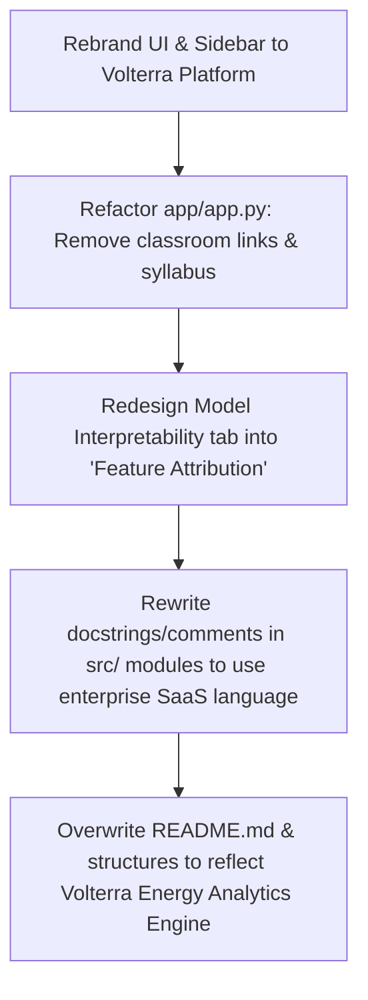

# Portfolio-Grade UI/UX & Codebase Audit Report
**Project**: Smart Electricity Consumption Predictor  
**Target Identity**: Volterra - Intelligent Energy Analytics Platform  
**Auditors**: Product Design Lead / Principal ML Engineer / Staff GitHub Reviewer  

---

## 🔍 Section 1: Identifying "Beginner Tutorial / AI-Generated" Signals

Across our audit, we identified several labels, headers, and UI widgets that scream *"classroom demonstration"* or *"AI-generated boilerplate"*:

### 1. Streamlit UI (app/app.py)
*   **Demo Mode vs. User Mode Toggle**: The choice between "Workshop Demo Mode" and "Standard User App" makes the interface feel like a toy. A professional analytics platform runs all diagnostic metrics in a dedicated "Developer Console" collapsable sidebar or "Model Diagnostics" sub-dashboard, not as a classroom toggle.
*   **Sidebar Classroom Syllabus**: The sidebar titles `Learn ML Basics`, `Supervised Learning`, `Regression`, and `Linear Regression` with basic definitions make the project look like a college homework submission.
*   **Footer Caption**: *"Designed for B.Tech Machine Learning Workshops & Laboratory Demonstrations"* explicitly labels the project as academic.

### 2. Codebase & Docstrings (src/)
*   **Module Descriptions**: Comments containing phrases like *"for teaching beginners"* or *"clean, production-grade functions for students"* downgrade the professional value.
*   **Notebook Naming**: `1.0-eda-and-modeling.ipynb` is a standard template name. It should be named `exploratory_data_analysis.ipynb` or `model_experimentation.ipynb`.

### 3. Documentation (README.md & Walkthroughs)
*   **Tone & Voice**: README references like *"designed to teach beginners"* and *"white-box laboratory showcase"* fail to align with a production-grade utility platform.

---

## 🛠️ Proposed Solution: Repositioning as "Volterra"

We will rebrand and refactor the repository into **Volterra**, an Intelligent Energy Analytics Platform. We will apply startup-grade naming, cleaner product-focused UX, and professional engineering documentation.

### Upgrades Roadmap

---

## 🎨 Repositioned UX/UI Layout (Volterra Engine)

### 1. Sidebar Menu (Enterprise Style)
*   **Configuration Presets**: Let users select preset scenarios (e.g. *Peak Summer Day*, *Mild Weekend*, *Eco-Mode*) rather than sliding inputs from scratch.
*   **Platform Info**: Displays model version, Docker status, and build hashes.

### 2. Main Dashboard Layout
*   **Hero KPI Banner**: Renders three metrics:
    1.  *Forecasted Consumption* (kWh)
    2.  *Projected Operating Cost* ($)
    3.  *Carbon Footprint Estimate* (kg CO₂)
*   **Dynamic Inputs**: Environmental parameters and appliance runtimes with professional descriptions.
*   **Interpretability Blocks**:
    *   Rename "Live Equation Solver" to **"Attribution Mechanics"** showing features' mathematical weights.
    *   Rename "Live Feature Contributions" to **"Impact Analysis"** with professional Seaborn/Plotly layout.
