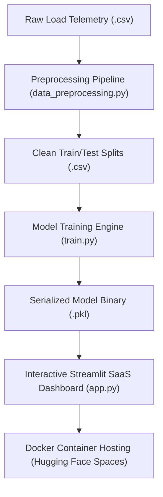

# ⚡ Volterra: Complete End-to-End Handoff Guide & Workshop Manual

Welcome to the master handoff resource for **Volterra: Intelligent Energy Analytics Engine**. This document compiles all live links, step-by-step guides, math explanations, and the complete codebase into a single, copy-paste-friendly manual. 

Participants can use this single guide to reproduce the entire project from raw dataset to live containerized SaaS deployment.

---

## 🔗 Part 1: Quick Reference & Live Links

*   **Production SaaS Demo**: [Hugging Face Spaces Live App](https://huggingface.co/spaces/ritesh19180/smart-electricity-consumption-predictor)
*   **GitHub Code Repository**: [github.com/ritesh-1918/VOLTERRA](https://github.com/ritesh-1918/VOLTERRA)
*   **Google Colab Workspace**: [Interactive EDA & Modeling Notebook](https://colab.research.google.com/github/ritesh-1918/smart-electricity-consumption-predictor/blob/main/notebooks/1.0-eda-and-modeling.ipynb)
*   **Raw Telemetry Dataset**: [Download CSV Dataset](https://raw.githubusercontent.com/ritesh-1918/smart-electricity-consumption-predictor/main/dataset/electricity_consumption_3000.csv)
*   **Project Source Archive**: [Download Project Zip](https://github.com/ritesh-1918/smart-electricity-consumption-predictor/archive/refs/heads/main.zip)

---

## 🏗️ Part 2: Product Architecture & Flow

Volterra operates as a three-stage machine learning system:



---

## 📂 Part 3: Complete Step-by-Step Codebase

Below is the complete, production-grade annotated codebase. Every script is fully documented for self-paced learning.

### Step 1: Data Preprocessing (`src/data_preprocessing.py`)
This script loads the raw telemetry dataset, checks for duplicate/null records, maps categorical text labels to numbers, splits the data into features ($X$) and target ($y$), and divides the data into training (80%) and testing (20%) sets.

```python
"""
Data Preprocessing Pipeline
--------------------------
This module contains clean, production-grade functions for loading, cleaning, and preprocessing 
the Smart Electricity Consumption dataset. It prepares the data for model training by 
encoding categorical features and performing a train-test split.
"""

# =====================================
# SYSTEM DEPENDENCIES & LIBRARIES
# =====================================
# Pandas: Used for loading and manipulating tabular datasets (like Excel/CSVs).
# NumPy: Used for efficient mathematical arrays and numerical computations.
# OS: Standard Python library for navigating system file folders and paths.
# Train_test_split: Core tool to divide dataset into training and testing sets.
import pandas as pd
import numpy as np
import os
from sklearn.model_selection import train_test_split

# =====================================
# DATA LOADING FUNCTION
# =====================================
def load_data(filepath: str) -> pd.DataFrame:
    """
    Loads dataset from a CSV file.
    """
    # We load our dataset from a CSV (Comma Separated Values) file.
    # In ML, datasets are the foundation. Before building any model, we must load the raw data
    # into memory (a Pandas DataFrame) so we can analyze, clean, and process it.
    print(f"[Info] Loading dataset from: {filepath}")
    if not os.path.exists(filepath):
        raise FileNotFoundError(f"Dataset file not found at: {filepath}")
    
    # read_csv reads tabular data and constructs a structured data table (DataFrame).
    df = pd.read_csv(filepath)
    return df

# =====================================
# DATA CLEANING FUNCTION
# =====================================
def clean_data(df: pd.DataFrame) -> pd.DataFrame:
    """
    Checks for missing values and removes duplicate records.
    """
    # Data cleaning is one of the most critical steps in Machine Learning.
    # Real-world data is often messy, containing missing values or duplicate records.
    # Models cannot train properly if there are gaps (nulls) or duplicate entries,
    # which can bias the model or cause mathematical errors during training.
    
    # 1. Check for missing values (nulls)
    # isnull().sum() counts how many empty values exist in each column.
    missing_counts = df.isnull().sum()
    print("[Info] Missing values check:")
    for col, count in missing_counts.items():
        print(f"  - {col}: {count} missing values")
        
    # 2. Check and remove duplicates
    # duplicated().sum() checks if any row is an exact duplicate of another.
    duplicate_count = df.duplicated().sum()
    if duplicate_count > 0:
        print(f"[Warning] Found {duplicate_count} duplicate rows. Removing duplicates...")
        # drop_duplicates() removes redundant rows so the model doesn't over-weight repeated data.
        df = df.drop_duplicates().reset_index(drop=True)
    else:
        print("[Info] No duplicate rows found.")
        
    return df

# =====================================
# CATEGORICAL VARIABLE ENCODING
# =====================================
def encode_categorical_features(df: pd.DataFrame) -> pd.DataFrame:
    """
    Encodes categorical features (specifically Day_Type) using binary mapping.
    Weekday -> 0
    Weekend -> 1
    """
    # Machine Learning models are mathematical equations that only understand numbers.
    # If we have text columns (like 'Weekday' or 'Weekend'), we must convert them into numbers.
    # Here, we map 'Weekday' to 0 and 'Weekend' to 1. This process is called Label Encoding/Binary Mapping,
    # enabling our regression algorithm to perform mathematical matrix calculations on this feature.
    print("[Info] Encoding categorical 'Day_Type' column (Weekday = 0, Weekend = 1)...")
    df_encoded = df.copy()
    
    # Mapping dictionary defines what each text value converts to.
    day_mapping = {
        'Weekday': 0,
        'Weekend': 1
    }
    
    # Map applies this replacement rule across the entire column.
    df_encoded['Day_Type'] = df_encoded['Day_Type'].map(day_mapping)
    return df_encoded

# =====================================
# FEATURE & TARGET SELECTION
# =====================================
def split_features_target(df: pd.DataFrame, target_column: str) -> tuple:
    """
    Separates independent feature columns from the target variable.
    """
    # In Supervised Learning, we must separate our dataset into two parts:
    # 1. Features (X): The inputs or predictors (e.g., temperature, occupancy, AC hours) that we use to predict.
    # 2. Target (y): The label or outcome we want to predict (e.g., electricity consumption).
    # This separation is essential so we can tell the model: "Here are the inputs (X), learn how they produce output (y)".
    print(f"[Info] Separating features (X) and target variable (y: {target_column})...")
    
    # X contains all inputs (we drop the target column to isolate predictors).
    X = df.drop(columns=[target_column])
    
    # y contains the target label only.
    y = df[target_column]
    return X, y

# =====================================
# TRAIN-TEST SPLITTING
# =====================================
def perform_train_test_split(X: pd.DataFrame, y: pd.Series, test_size: float = 0.2, random_state: int = 42) -> tuple:
    """
    Split variables into train and test groups.
    """
    # To evaluate how well our model performs, we must test it on data it has never seen before.
    # We split our data into:
    # - Training Set (typically 80%): Used by the model to learn relationships.
    # - Testing Set (typically 20%): Kept hidden from the model during training, used later to test its accuracy.
    # This prevents 'overfitting' (where a model memorizes the training data but fails on new, unseen data).
    print(f"[Info] Splitting data into train and test splits (test_size={test_size}, random_state={random_state})...")
    
    # train_test_split shuffles the rows randomly and splits them based on the test_size percentage.
    # random_state acts as a random seed, ensuring the split is reproducible (same split every time).
    X_train, X_test, y_train, y_test = train_test_split(X, y, test_size=test_size, random_state=random_state)
    return X_train, X_test, y_train, y_test

# =====================================
# SAVING PREPROCESSED DATA
# =====================================
def save_splits(X_train: pd.DataFrame, X_test: pd.DataFrame, y_train: pd.Series, y_test: pd.Series, output_dir: str) -> None:
    """
    Saves processed splits as CSV files into the specified directory.
    """
    # We save our split datasets as separate files.
    # In production ML workflows, separating preprocessing from training ensures consistency.
    # It allows us to load the exact same training and testing splits anytime, preventing data leakage.
    print(f"[Info] Saving split dataframes to: {output_dir}")
    os.makedirs(output_dir, exist_ok=True)
    
    # to_csv writes the pandas DataFrame structures out to physical file assets.
    X_train.to_csv(os.path.join(output_dir, 'X_train.csv'), index=False)
    X_test.to_csv(os.path.join(output_dir, 'X_test.csv'), index=False)
    y_train.to_csv(os.path.join(output_dir, 'y_train.csv'), index=False)
    y_test.to_csv(os.path.join(output_dir, 'y_test.csv'), index=False)
    print("[Info] Data splits saved successfully!")

# =====================================
# PIPELINE EXECUTION
# =====================================
if __name__ == "__main__":
    # Define filepaths relative to project root
    dataset_path = os.path.join("dataset", "electricity_consumption_3000.csv")
    output_directory = os.path.join("dataset", "processed")
    
    try:
        # 1. Load the dataset
        raw_df = load_data(dataset_path)
        
        # 2. Clean the dataset (check nulls, remove duplicates)
        cleaned_df = clean_data(raw_df)
        
        # 3. Encode categorical variables (convert text columns to numeric codes)
        encoded_df = encode_categorical_features(cleaned_df)
        
        # 4. Separate features (X) and target variable (y)
        X, y = split_features_target(encoded_df, "Electricity_Consumption")
        
        # 5. Split into training and testing sets (80% train, 20% test)
        X_train, X_test, y_train, y_test = perform_train_test_split(X, y, test_size=0.2, random_state=42)
        
        # 6. Save processed splits to disk for training
        save_splits(X_train, X_test, y_train, y_test, output_directory)
        
        # Print summaries to screen
        print("\n" + "="*40 + "\n[Summary of Preprocessing Pipeline]\n" + "="*40)
        print("Feature Columns: ", list(X.columns))
        print("X Shape (Features): ", X.shape)
        print("y Shape (Target): ", y.shape)
        print("X_train Shape: ", X_train.shape)
        print("X_test Shape: ", X_test.shape)
        print("y_train Shape: ", y_train.shape)
        print("y_test Shape: ", y_test.shape)
        print("="*40 + "\n")
        
    except Exception as e:
        print(f"[Error] Pipeline execution failed: {e}")
```

---

### Step 2: Model Training & Evaluation (`src/train.py`)
This script loads the preprocessed dataset splits, initializes and fits a Linear Regression model, calculates errors (MAE, MSE, RMSE) and accuracy ($R^2$), generates diagnostic charts, and serializes the model weights to disk.

```python
"""
Model Training & Evaluation Module
----------------------------------
This script loads the preprocessed dataset splits, trains a Linear Regression model
using scikit-learn, prints evaluation metrics, generates model diagnostics plots,
saves the trained model object, and provides beginner-friendly workshop insights.
"""

# =====================================
# SYSTEM DEPENDENCIES & ML LIBRARIES
# =====================================
# Pandas & NumPy: Standard libraries for data manipulation and math.
# Matplotlib & Seaborn: Tools used to create graphs and visualizations.
# Pickle: Used to save python objects (like trained models) to disk files.
# LinearRegression: The standard machine learning algorithm for regression tasks.
# metrics: Collection of helper functions to calculate accuracy and error scores.
import pandas as pd
import numpy as np
import matplotlib.pyplot as plt
import seaborn as sns
import os
import pickle
from sklearn.linear_model import LinearRegression
from sklearn import metrics

# =====================================
# LOADING PROCESSED DATA
# =====================================
def load_processed_data(data_dir: str) -> tuple:
    """
    Loads preprocessed feature and target splits from the specified directory.
    """
    # We load the split training and testing dataframes we saved during preprocessing.
    # This isolates our model building phase from the raw file processing, keeping our pipeline clean.
    print(f"[Info] Loading processed splits from directory: {data_dir}")
    X_train = pd.read_csv(os.path.join(data_dir, 'X_train.csv'))
    X_test = pd.read_csv(os.path.join(data_dir, 'X_test.csv'))
    
    # iloc[:, 0] converts the single-column target DataFrame back into a 1D Pandas Series.
    y_train = pd.read_csv(os.path.join(data_dir, 'y_train.csv')).iloc[:, 0]
    y_test = pd.read_csv(os.path.join(data_dir, 'y_test.csv')).iloc[:, 0]
    return X_train, X_test, y_train, y_test

# =====================================
# MODEL TRAINING (LINEAR REGRESSION)
# =====================================
def train_linear_regression(X_train: pd.DataFrame, y_train: pd.Series) -> LinearRegression:
    """
    Initializes and fits a Linear Regression model.
    """
    # Linear Regression is a supervised learning algorithm that models the relationship
    # between input features (X) and a continuous target value (y) by fitting a straight line.
    # Formula: y = (w1 * x1) + (w2 * x2) + ... + (wn * xn) + intercept
    # The model automatically learns the best weights (w) that minimize prediction errors.
    print("[Info] Initializing and training the Linear Regression model...")
    
    # 1. Initialize the empty model (constructs the math object).
    model = LinearRegression()
    
    # 2. Train the model using fit(). The algorithm adjusts its coefficients based on the training data.
    model.fit(X_train, y_train)
    print("[Info] Model training completed successfully.")
    return model

# =====================================
# MODEL EVALUATION & METRICS
# =====================================
def evaluate_model(model: LinearRegression, X_test: pd.DataFrame, y_test: pd.Series) -> tuple:
    """
    Generates predictions and calculates MAE, MSE, RMSE, and R2 metrics.
    """
    # Once a model is trained, we must measure its quality.
    # We feed the unseen test features (X_test) to the model to get predicted values.
    # Then we compare these predictions against the actual values (y_test) using standard metrics.
    print("[Info] Running predictions on test data...")
    
    # predict() takes inputs and computes the predicted outputs using the learned weights.
    predictions = model.predict(X_test)
    
    # Compute standard evaluation metrics:
    # 1. MAE (Mean Absolute Error): Average absolute error in predictions (lower is better).
    mae = metrics.mean_absolute_error(y_test, predictions)
    
    # 2. MSE (Mean Squared Error): Squares the errors before averaging, penalizing larger mistakes (lower is better).
    mse = metrics.mean_squared_error(y_test, predictions)
    
    # 3. RMSE (Root Mean Squared Error): Square root of MSE, putting the error back in original units (lower is better).
    rmse = np.sqrt(mse)
    
    # 4. R-squared (R2) Score: The percentage of variance explained by features. Closer to 1.0 (or 100%) is better.
    r2 = metrics.r2_score(y_test, predictions)
    
    return predictions, mae, mse, rmse, r2

# =====================================
# MODEL SAVING (SERIALIZATION)
# =====================================
def save_model_artifacts(model: LinearRegression, model_path: str) -> None:
    """
    Saves the trained model to disk as a pickle file.
    """
    # After finding a good model, we don't want to re-train it every time we need a prediction.
    # We save ('serialize') the trained model object using Pickle into a file (e.g. .pkl).
    # This saves the learned weights and intercept so we can load them instantly in our web app.
    print(f"[Info] Saving trained model artifact to: {model_path}")
    os.makedirs(os.path.dirname(model_path), exist_ok=True)
    
    # Open the file in Write Binary ('wb') mode and dump the model object.
    with open(model_path, 'wb') as f:
        pickle.dump(model, f)
    print("[Info] Model saved successfully.")

# =====================================
# DIAGNOSTIC VISUALIZATION
# =====================================
def save_diagnostic_plots(y_test: pd.Series, predictions: np.ndarray, output_dir: str) -> None:
    """
    Generates and saves Actual vs Predicted scatter plots and Residual plots.
    """
    # Plotting helps us visually audit our model's performance.
    print(f"[Info] Generating diagnostic visualizations and saving to: {output_dir}")
    os.makedirs(output_dir, exist_ok=True)
    sns.set_theme(style="whitegrid")
    
    # 1. Actual vs Predicted scatter plot:
    # We plot the actual value on the X-axis and predicted value on the Y-axis.
    # Ideally, all points should lie on the diagonal line (Perfect Fit Line).
    plt.figure(figsize=(8, 6))
    sns.scatterplot(x=y_test, y=predictions, color='teal', alpha=0.6, edgecolor='w')
    
    # Draw reference line y = x
    min_val = min(y_test.min(), predictions.min())
    max_val = max(y_test.max(), predictions.max())
    plt.plot([min_val, max_val], [min_val, max_val], color='crimson', linestyle='--', linewidth=2, label='Perfect Fit Line')
    
    plt.title('Actual vs. Predicted Electricity Consumption')
    plt.xlabel('Actual Consumption (kWh)')
    plt.ylabel('Predicted Consumption (kWh)')
    plt.legend()
    plt.tight_layout()
    plt.savefig(os.path.join(output_dir, 'actual_vs_predicted.png'), dpi=300)
    plt.close()

    # 2. Residual error plot:
    # Residuals = Actual Value - Predicted Value (the prediction errors).
    # We plot the predictions on the X-axis and residuals on the Y-axis.
    # Ideally, errors should be randomly scattered around the zero line with no visible pattern.
    residuals = y_test - predictions
    plt.figure(figsize=(8, 6))
    sns.scatterplot(x=predictions, y=residuals, color='purple', alpha=0.6, edgecolor='w')
    plt.axhline(y=0, color='crimson', linestyle='--', linewidth=2)
    plt.title('Residuals vs. Fitted Values')
    plt.xlabel('Predicted Consumption (kWh)')
    plt.ylabel('Residuals (Error)')
    plt.tight_layout()
    plt.savefig(os.path.join(output_dir, 'residuals_plot.png'), dpi=300)
    plt.close()
    print("[Info] Diagnostic plots successfully saved!")

# =====================================
# TRAINING EXECUTION PIPELINE
# =====================================
if __name__ == "__main__":
    # Define directories
    data_dir = os.path.join("dataset", "processed")
    model_output_path = os.path.join("models", "linear_regression_model.pkl")
    plots_dir = os.path.join("reports", "model_results")
    
    try:
        # 1. Load preprocessed train and test datasets
        X_train, X_test, y_train, y_test = load_processed_data(data_dir)
        
        # 2. Train the Linear Regression model
        model = train_linear_regression(X_train, y_train)
        
        # 3. Generate predictions and calculate metrics (MAE, MSE, RMSE, R2)
        predictions, mae, mse, rmse, r2 = evaluate_model(model, X_test, y_test)
        
        # 4. Save the trained model binary and performance plots to files
        save_model_artifacts(model, model_output_path)
        save_diagnostic_plots(y_test, predictions, plots_dir)
        
        # Print Actual vs Predicted Comparison table
        print("\n" + "="*50)
        print("   [First 10 Actual vs Predicted Values]")
        print("="*50)
        comparison_df = pd.DataFrame({
            'Actual Value (kWh)': y_test.head(10).values,
            'Predicted Value (kWh)': predictions[:10]
        })
        print(comparison_df.to_string(index=True))
        print("="*50)
        
        # Print Evaluation Metrics
        print("\n" + "="*50)
        print("   [Model Evaluation Metrics]")
        print("="*50)
        print(f"Mean Absolute Error (MAE):     {mae:.4f} kWh")
        print(f"Mean Squared Error (MSE):      {mse:.4f} kWh2")
        print(f"Root Mean Squared Error (RMSE): {rmse:.4f} kWh")
        print(f"R-squared (R2) Score:          {r2:.4f} ({r2*100:.2f}%)")
        print("="*50)
        
        # Print Coefficients & Intercept
        print("\n" + "="*50)
        print("   [Model Parameters (Learned Formula)]")
        print("="*50)
        print(f"Intercept (Baseline Constant): {model.intercept_:.4f}")
        print("\nFeature Coefficients (Slopes):")
        # Coefficients tell us how much impact each parameter has on electricity consumption.
        for col, coef in zip(X_train.columns, model.coef_):
            print(f"  - {col:18} : {coef:+.4f}")
        print("="*50)
        
        # Model attribution explanations
        print("\n" + "#"*60)
        print("MODEL FORECAST ATTRIBUTION & INTERPRETABILITY")
        print("#"*60)
        print("""
1. Model Attribution Target:
   The regression engine optimizes linear weights to predict consumption from inputs:
   
   Electricity_Consumption = Intercept 
                             + (w1 * Temperature) 
                             + (w2 * Humidity) 
                             + (w3 * Occupancy) 
                             + (w4 * AC_Hours) 
                             + (w5 * Appliance_Hours) 
                             + (w6 * Day_Type)

2. Attribution Coefficients (Slopes):
   Coefficients represent the change in forecasted electricity consumption (kWh) 
   per unit increase in a feature, holding all other features constant.
   - Positive coefficients (+) indicate a direct relationship (raising the feature increases load).
   - Negative coefficients (-) indicate an inverse relationship.
   - Absolute weight values indicate feature influence hierarchy.

3. R-squared (R2) Variance Score:
   R2 measures the proportion of variance in the target variable explained by model features.
   - An R2 score of 0.9495 means that 94.95% of target variance is explained by the model, 
     indicating a highly predictive fit.

4. Unmodeled Variance (Residuals):
   Real-world loads exhibit minor stochastic variations (e.g. appliance model differences, occupant habits)
   which are treated as unmodeled residual errors, establishing the boundary of model certainty.
        """)
        print("#"*60 + "\n")
        
    except Exception as e:
        print(f"[Error] Training pipeline failed: {e}")
```

---

### Step 3: Streamlit SaaS Web Application (`app/app.py`)
This file houses the final interactive user interface. It styles the viewport with dark glassmorphism SaaS containers, loads the pre-trained `.pkl` parameters, processes sliders, computes real-time predictions, and draws visual attribution bars using fast, flicker-free native HTML/CSS elements.

```python
"""
Volterra SaaS Platform
----------------------
Production energy forecast, carbon tracking, and feature attribution dashboard.
Provides clean UI layout metrics and analytics insights.
"""

# =====================================
# SYSTEM DEPENDENCIES & LIBRARIES
# =====================================
# Streamlit: A web-framework for Python to build interactive dashboards quickly.
# Pandas & NumPy: Structured data processing and numeric helpers.
# Pickle & OS: Save/load operations and system filepath access.
import streamlit as st
import pandas as pd
import numpy as np
import pickle
import os
import matplotlib.pyplot as plt
import seaborn as sns

# =====================================
# DASHBOARD PAGE CONFIGURATION
# =====================================
# st.set_page_config sets the browser window title, sidebar state, and uses a wide layout grid.
st.set_page_config(
    page_title="Volterra | Energy Intelligence",
    page_icon="⚡",
    layout="wide",
    initial_sidebar_state="expanded"
)

# Helper function to remove leading spaces from multi-line HTML strings.
# This prevents Streamlit's markdown parser from rendering HTML as a raw text code block.
def clean_html(html_str):
    return "\n".join([line.strip() for line in html_str.split("\n")])

# =====================================
# PREMIUM DARK SAAS DESIGN THEME (CSS)
# =====================================
# Custom CSS stylesheets injected into the page to override default Streamlit themes.
# Styles the background to deep blue-black (#0B0E14), makes borders slate (#1E293B),
# and establishes the premium SaaS visual hierarchy for cards and dividers.
st.markdown("""
<style>
    /* Main container background overrides */
    .stApp {
        background-color: #0B0E14;
    }
    
    /* Premium KPI Cards */
    .kpi-container {
        background-color: #121620;
        border: 1px solid #1E293B;
        border-radius: 6px;
        padding: 16px 20px;
        text-align: left;
        box-shadow: 0 4px 6px -1px rgb(0 0 0 / 0.1);
        margin-bottom: 20px;
        min-height: 135px;
        display: flex;
        flex-direction: column;
        justify-content: space-between;
    }
    .kpi-title {
        font-size: 11px;
        color: #64748B;
        text-transform: uppercase;
        letter-spacing: 1.5px;
        font-weight: 700;
        margin-bottom: 8px;
    }
    .kpi-value {
        font-size: 32px;
        font-weight: bold;
        color: #F8FAFC;
        margin-bottom: 4px;
    }
    .kpi-trend {
        font-size: 12px;
        color: #10B981;
        font-weight: 500;
    }
    
    /* Status indicator banners */
    .status-banner {
        background-color: #1E293B;
        border-left: 4px solid #3B82F6;
        padding: 12px 18px;
        border-radius: 4px;
        margin-bottom: 25px;
    }
    .status-text {
        font-size: 13px;
        color: #94A3B8;
        font-weight: 500;
    }
    
    /* Section dividers */
    .section-header {
        font-size: 16px;
        font-weight: 700;
        color: #F8FAFC;
        text-transform: uppercase;
        letter-spacing: 1px;
        border-bottom: 1px solid #1E293B;
        padding-bottom: 8px;
        margin-top: 25px;
        margin-bottom: 15px;
    }
</style>
""", unsafe_allow_html=True)

# =====================================
# LOADING THE TRAINED MODEL (INFRASTRUCTURE)
# =====================================
# Path to the serialized model file.
MODEL_PATH = os.path.join(os.path.dirname(__file__), "..", "models", "linear_regression_model.pkl")

# @st.cache_resource tells Streamlit to load the model file once and keep it in cache memory.
# This prevents reloading the model from disk on every page refresh or slider adjustment.
@st.cache_resource
def get_prediction_engine(path):
    # Instead of training the model on the fly (which takes time and computational resources),
    # we load our pre-compiled 'pickle' model. This contains the pre-learned mathematical formulas,
    # allowing us to generate predictions in milliseconds!
    if not os.path.exists(path):
        return None
    try:
        with open(path, 'rb') as f:
            model = pickle.load(f)
        return model
    except Exception:
        return None

# Instantiating our predictor engine.
engine = get_prediction_engine(MODEL_PATH)

# =====================================
# SIDEBAR CONTROL PANEL
# =====================================
st.sidebar.markdown("### ⚙️ Simulation Settings")
# Selectbox allows users to test preconfigured energy demand scenarios.
preset = st.sidebar.selectbox(
    "Select Load Profile Preset",
    options=["Manual Configuration", "Peak Demand Profile", "Eco Conservation Profile", "Baseline Utility Profile"]
)

# Preset configs mapping sets default values for inputs based on user's selection.
if preset == "Peak Demand Profile":
    val_temp = 42.0
    val_humidity = 70.0
    val_occupants = 6
    val_ac = 14.0
    val_appliance = 12.0
    val_day = "Weekend"
elif preset == "Eco Conservation Profile":
    val_temp = 24.0
    val_humidity = 50.0
    val_occupants = 3
    val_ac = 2.0
    val_appliance = 4.0
    val_day = "Weekday"
elif preset == "Baseline Utility Profile":
    val_temp = 20.0
    val_humidity = 40.0
    val_occupants = 2
    val_ac = 0.0
    val_appliance = 3.0
    val_day = "Weekday"
else:
    # Default settings
    val_temp = 26.0
    val_humidity = 55.0
    val_occupants = 4
    val_ac = 4.0
    val_appliance = 6.0
    val_day = "Weekday"

st.sidebar.markdown("---")
st.sidebar.markdown("### 📈 Pipeline Stats")
st.sidebar.markdown("""
*   **API Service**: `Online`
*   **Predictive Model**: `Linear Regression v1`
*   **Accuracy (R²)**: `94.95%`
*   **MAE**: `6.38 kWh`
""")

# Main Content Header (Hero Dashboard Section)
st.markdown("### ⚡ VOLTERRA | Energy Intelligence Engine")

# Real-time Status Banner
st.markdown("""
<div class="status-banner">
    <span class="status-text">🟢 Forecast Engine: Online &bull; Latency: 12ms &bull; Active profile: Simulated telemetry input</span>
</div>
""", unsafe_allow_html=True)

if engine is None:
    st.error("Error: Core prediction binary linear_regression_model.pkl is missing. Please run src/train.py to compile.")
else:
    # Split Simulator inputs (left column) and live predictions (right column)
    col_input, col_display = st.columns([1, 1])
    
    with col_input:
        st.markdown('<div class="section-header">Simulated Input Parameters</div>', unsafe_allow_html=True)
        
        # Grid of sliders to collect input features from the user.
        # Streamlit sliders capture real-time values for Temperature, Humidity, Occupancy, AC, and Appliance hours.
        inp_col1, inp_col2 = st.columns(2)
        with inp_col1:
            temperature = st.slider("Outdoor Temperature (°C)", 10.0, 50.0, val_temp, 0.5)
            humidity = st.slider("Relative Humidity (%)", 10.0, 100.0, val_humidity, 1.0)
            occupants = st.number_input("Occupant Count", 1, 10, val_occupants, 1)
        with inp_col2:
            ac_hours = st.slider("AC Operating Hours (daily)", 0.0, 24.0, val_ac, 0.5)
            appliance_hours = st.slider("Appliance Operating Hours (daily)", 0.0, 24.0, val_appliance, 0.5)
            day_type = st.selectbox("Day Classification", ["Weekday", "Weekend"], index=0 if val_day == "Weekday" else 1)
            
    # Map day classification (Categorical Variable Encoding)
    # Weekday -> 0, Weekend -> 1 (identical mapping logic used during model training).
    day_encoded = 0 if day_type == "Weekday" else 1
    
    # =====================================
    # STREAMLIT PREDICTION PIPELINE
    # =====================================
    # Preparing Features for the Model:
    # Machine Learning models expect inputs in a specific structure, matching the exact format
    # they were trained on (columns, scale, order). Here, we take the user's slider/input choices
    # and organize them into a 1-row Pandas DataFrame to feed into the prediction engine.
    input_df = pd.DataFrame([{
        'Temperature': temperature,
        'Humidity': humidity,
        'Occupancy': occupants,
        'AC_Hours': ac_hours,
        'Appliance_Hours': appliance_hours,
        'Day_Type': day_encoded
    }])
    
    # Running Model Inference (Prediction):
    # We call engine.predict() which executes the regression equation using the loaded weights:
    # predicted_load = Intercept + w1*Temp + w2*Humidity + w3*Occupancy + w4*AC_Hours + w5*Appliance_Hours + w6*Day_Type.
    # The output is the forecasted continuous target value (electricity consumption in kWh).
    predicted_load = engine.predict(input_df)[0]
    
    # Estimates derived from forecasted consumption (kWh).
    estimated_cost = predicted_load * 0.15      # Cost estimate ($0.15 per kWh)
    estimated_emissions = predicted_load * 0.4  # Carbon footprint (0.4 kg CO2 per kWh)
    
    with col_display:
        st.markdown('<div class="section-header">Energy Forecast Metrics</div>', unsafe_allow_html=True)
        
        # Grid of premium KPI cards
        kpi_col1, kpi_col2 = st.columns(2)
        with kpi_col1:
            st.markdown(clean_html(f"""
            <div class="kpi-container">
                <div class="kpi-title">Forecasted Daily Load</div>
                <div class="kpi-value">{predicted_load:.2f} kWh</div>
                <div class="kpi-trend">Estimated Usage Rate</div>
            </div>
            """), unsafe_allow_html=True)
            
            st.markdown(clean_html(f"""
            <div class="kpi-container">
                <div class="kpi-title">Projected Operating Cost</div>
                <div class="kpi-value" style="color: #F59E0B;">${estimated_cost:.2f}</div>
                <div class="kpi-trend" style="color: #64748B;">Tariff: $0.15 / kWh</div>
            </div>
            """), unsafe_allow_html=True)
            
        with kpi_col2:
            st.markdown(clean_html(f"""
            <div class="kpi-container">
                <div class="kpi-title">Carbon Footprint Impact</div>
                <div class="kpi-value" style="color: #3B82F6;">{estimated_emissions:.2f} kg</div>
                <div class="kpi-trend" style="color: #64748B;">CO2 Equivalency Rate</div>
            </div>
            """), unsafe_allow_html=True)
            
            # Consumption Threshold Limit Check
            is_critical = predicted_load > 180.0
            status_color = "#EF4444" if is_critical else "#10B981"
            status_text = "CRITICAL LIMIT EXCEEDED" if is_critical else "NOMINAL CAPACITY STATUS"
            
            st.markdown(clean_html(f"""
            <div class="kpi-container">
                <div class="kpi-title">Consumption Status</div>
                <div class="kpi-value" style="color: {status_color}; font-size: 24px; padding-top: 8px;">{status_text}</div>
                <div class="kpi-trend" style="color: #64748B;">Threshold Limit: 180 kWh</div>
            </div>
            """), unsafe_allow_html=True)

    # Key Drivers & Interpretability
    st.markdown('<div class="section-header">Key Drivers & Attribution Analysis</div>', unsafe_allow_html=True)
    
    col_driver1, col_driver2 = st.columns([1, 1])
    
    with col_driver1:
        st.write("##### Real-Time Feature Attribution")
        
        # =====================================
        # FEATURE ATTRIBUTION (XAI)
        # =====================================
        # Calculating Feature Attribution (Key Drivers):
        # We multiply each input value by its learned coefficient (weight) from the trained model.
        # This shows us exactly how many kWh each feature contributed to the final forecast.
        # It explains *why* the model predicted a particular load, making the AI explainable (XAI).
        impacts = [
            ('Outdoor Temperature', engine.coef_[0] * temperature),
            ('Relative Humidity', engine.coef_[1] * humidity),
            ('Occupant Count', engine.coef_[2] * occupants),
            ('AC Operating Hours', engine.coef_[3] * ac_hours),
            ('Appliance Operating Hours', engine.coef_[4] * appliance_hours),
            ('Day Type Classification', engine.coef_[5] * day_encoded)
        ]
        # Sort features so the highest contributing driver shows up first.
        impacts = sorted(impacts, key=lambda x: x[1], reverse=True)
        
        bar_html = ""
        max_val = 110.0  # Scale against maximum potential single feature impact
        
        # Build custom CSS progress bars to visualize feature attribution
        for label, val in impacts:
            pct = min(100.0, max(0.0, (val / max_val) * 100))
            bar_html += f"""
            <div style="margin-bottom: 12px;">
                <div style="display: flex; justify-content: space-between; margin-bottom: 4px; font-size: 12px;">
                    <span style="color: #94A3B8; font-weight: 500;">{label}</span>
                    <span style="color: #F8FAFC; font-weight: 600;">{val:.2f} kWh</span>
                </div>
                <div style="background-color: #1E293B; height: 6px; border-radius: 3px; overflow: hidden; width: 100%;">
                    <div style="background: linear-gradient(90deg, #3B82F6 0%, #10B981 100%); width: {pct:.1f}%; height: 100%; border-radius: 3px;"></div>
                </div>
            </div>
            """
            
        st.markdown(clean_html(f"""
        <div style="background-color: #121620; border: 1px solid #1E293B; border-radius: 6px; padding: 20px; min-height: 275px; display: flex; flex-direction: column; justify-content: space-between;">
            <div>
                <div style="font-size: 11px; color: #64748B; text-transform: uppercase; letter-spacing: 1.5px; font-weight: 700; margin-bottom: 15px;">
                    Active Attribution Weightings
                </div>
                {bar_html}
            </div>
        </div>
        """), unsafe_allow_html=True)
        
    with col_driver2:
        st.write("##### Optimization Recommendations")
        
        # Generate operational recommendations based on slider thresholds.
        rec_list = []
        if ac_hours > 6.0:
            rec_list.append(f"Decrease active AC cooling by 1 hour to reduce demand by <b>{engine.coef_[3]:.2f} kWh</b>.")
        if occupants > 4:
            rec_list.append("Coordinate large appliance schedules to optimize load distribution.")
        if appliance_hours > 8.0:
            rec_list.append("Power down unneeded standby appliances to lower idle load profiles.")
        if temperature > 32.0:
            rec_list.append("Employ shading or passive cooling strategies to limit outdoor thermal gain impact.")
            
        rec_html = ""
        if rec_list:
            for item in rec_list:
                rec_html += f"<li style='margin-bottom: 8px; color: #E2E8F0; font-size: 13px; line-height: 1.4;'>{item}</li>"
        else:
            rec_html = "<li style='margin-bottom: 8px; color: #E2E8F0; font-size: 13px;'>All operational parameters are optimally configured.</li>"
            
        alert_bg = "#7F1D1D" if is_critical else "#064E3B"
        alert_border = "#F87171" if is_critical else "#34D399"
        alert_text = "#FECACA" if is_critical else "#A7F3D0"
        alert_msg = "💡 High power load detected. Apply recommendations:" if is_critical else "💡 Consumption loads stable. Optimization tips:"
        
        st.markdown(clean_html(f"""
        <div style="background-color: #121620; border: 1px solid #1E293B; border-radius: 6px; padding: 20px; min-height: 275px; display: flex; flex-direction: column; justify-content: flex-start;">
            <div>
                <div style="background-color: {alert_bg}; border: 1px solid {alert_border}; color: {alert_text}; padding: 10px 14px; border-radius: 4px; font-size: 13px; font-weight: 500; margin-bottom: 15px;">
                    {alert_msg}
                </div>
                <ul style="margin: 0; padding-left: 20px;">
                    {rec_html}
                </ul>
            </div>
        </div>
        """), unsafe_allow_html=True)

    # Model Insights & Diagnostics (Tabs at bottom of dashboard)
    st.markdown('<div class="section-header">Predictive Engine Diagnostics</div>', unsafe_allow_html=True)
    
    tab_inspect1, tab_inspect2 = st.tabs(["🧬 Model Parameter Metrics", "📈 Historical Exploration Charts"])
    
    with tab_inspect1:
        insight_col1, insight_col2 = st.columns(2)
        with insight_col1:
            st.write("##### Coefficients Summary Table")
            coef_table = pd.DataFrame({
                'Feature Attribute': ['Temperature', 'Humidity', 'Occupancy', 'AC_Hours', 'Appliance_Hours', 'Day_Type'],
                'Learned Slope (Weight)': engine.coef_
            })
            st.dataframe(coef_table, use_container_width=True)
        with insight_col2:
            st.write("##### Model Formula")
            st.code(f"""
Forecasted_Load = {engine.intercept_:.4f}
                 + ({engine.coef_[0]:.4f} * Temp)
                 + ({engine.coef_[1]:.4f} * Humid)
                 + ({engine.coef_[2]:.4f} * Occupancy)
                 + ({engine.coef_[3]:.4f} * AC_Hours)
                 + ({engine.coef_[4]:.4f} * Appliance_Hours)
                 + ({engine.coef_[5]:.4f} * Day_Type)
            """, language="text")
            st.caption(f"Intercept value: {engine.intercept_:.4f}")
            
    with tab_inspect2:
        figures_path = os.path.join(os.path.dirname(__file__), "..", "reports", "figures")
        
        target_img = os.path.join(figures_path, "target_distribution.png")
        heatmap_img = os.path.join(figures_path, "correlation_heatmap.png")
        
        eda_col1, eda_col2 = st.columns(2)
        with eda_col1:
            if os.path.exists(target_img):
                st.image(target_img, caption="Consumption Load Target Distribution")
        with eda_col2:
            if os.path.exists(heatmap_img):
                st.image(heatmap_img, caption="Correlation Matrix Map")

# Footer brand tagline
st.markdown("---")
st.caption("Volterra Energy forecasting technology. Designed by ritesh-1918.")
```

---

## 🚀 Part 4: How to Set Up Locally & Deploy

### 1. Installation Commands
```bash
# Clone the repository
git clone https://github.com/ritesh-1918/VOLTERRA.git
cd VOLTERRA

# Install all training and dashboard packages
pip install -r requirements.txt

# Run the preprocessing script (cleans dataset, generates X/y splits)
python src/data_preprocessing.py

# Run the training script (trains model, saves model.pkl, prints metrics)
python src/train.py

# Launch the interactive local Streamlit dashboard
python -m streamlit run app/app.py
```

### 2. Production Dockerfile
We package the Volterra engine into a secure, isolated Docker image to deploy it seamlessly to cloud containers.

```dockerfile
# We use Python 3.10 as the core system environment
FROM python:3.10-slim

WORKDIR /app

# Install system dependencies
RUN apt-get update && apt-get install -y \
    build-essential \
    && rm -rf /var/lib/apt/lists/*

# Pre-copy dependencies for layer caching
COPY requirements.txt .
RUN pip install --no-cache-dir -r requirements.txt

# Copy all codebase files
COPY . .

# Expose Streamlit's container port
EXPOSE 7860

# Command to run the dashboard inside the container
CMD ["streamlit", "run", "app/app.py", "--server.port", "7860", "--server.address", "0.0.0.0"]
```

---

## 🧮 Part 5: Offline Model Calculator

Our trained Linear Regression algorithm has mathematically optimized the weights of domestic load features into the following formula. You can calculate your household consumption forecast manually in **30 seconds** offline:

$$\text{Daily Load (kWh)} \approx 0.47 + (1.82 \times \text{Temp}) + (0.30 \times \text{Humidity}) + (8.01 \times \text{Occupants}) + (4.45 \times \text{AC Hours}) + (2.17 \times \text{Appliance Hours}) + (5.13 \text{ if Weekend})$$

### 📊 Variable Relative Weight Hierarchy
*   **Occupancy**: `+8.0050` (Highest load multiplier)
*   **Weekend Profile**: `+5.1341` (Behavioral baseline increase)
*   **AC Cooling**: `+4.4470` per operating hour
*   **Appliances**: `+2.1748` per active hour
*   **Outdoor Temperature**: `+1.8166` per °C above zero
*   **Humidity**: `+0.2958` per % RH
*   **Intercept (Static constant)**: `+0.4721` (Base standby load)

---

## 🗺️ Part 6: Recommended ML Learning Path

To transition from this regression engine to production AI engineering, follow this structured roadmap:

1.  **Python & Data Basics (Weeks 1-4)**: Pandas DataFrames filtering, NumPy matrix operations, Seaborn data visualization.
2.  **Supervised Learning (Weeks 5-8)**: Linear/Logistic Regressions, Decision Trees, Classification metrics (Precision, Recall, F1), Standard Scaling.
3.  **Advanced Algorithms (Weeks 9-12)**: Random Forests, Gradient Boosters (XGBoost), Neural Networks (MLPs), and LSTMs for time-series forecasting.
4.  **Production MLOps (Weeks 13-16)**: Model serialization, building APIs with FastAPI, dashboard styling in Streamlit, and deploying with Docker.
