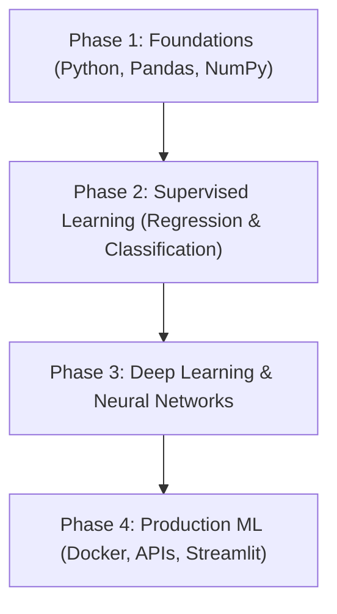

# Volterra: Recommended Machine Learning Roadmap

Congratulations on completing the forecasting workshop! Use this step-by-step roadmap to transition from basic regression models to advanced production-grade AI engineering.

---

---

## 🗺️ Step-by-Step Path

### Phase 1: Python and Data Foundations (Weeks 1-4)
*   **Target**: Get comfortable manipulating arrays and loading tabular data.
*   **Topics**:
    *   Python lists, dicts, list comprehensions, and functions.
    *   Pandas DataFrames: filtering, grouping, merging, and cleaning missing values.
    *   NumPy: matrix multiplication, broadcasting, and vector operations.
    *   Seaborn & Matplotlib: plotting distributions, boxplots, and heatmaps.

### Phase 2: Core Supervised Learning (Weeks 5-8)
*   **Target**: Learn when and how to apply standard algorithms.
*   **Topics**:
    *   **Regression**: Linear Regression, Ridge, Lasso, and Decision Trees.
    *   **Classification**: Logistic Regression, Random Forest, and Support Vector Machines (SVM).
    *   **Evaluation Metrics**: MAE, MSE, RMSE, R², Accuracy, Precision, Recall, F1-Score, and Confusion Matrix.
    *   **Feature Engineering**: Standard scaling, MinMax normalization, and One-Hot encoding.

### Phase 3: Neural Networks & Deep Learning (Weeks 9-12)
*   **Target**: Master unstructured data processing (text, images).
*   **Topics**:
    *   Multi-Layer Perceptrons (MLPs), backpropagation, and activation functions (ReLU, Sigmoid).
    *   Convolutional Neural Networks (CNNs) for image classification.
    *   Recurrent Neural Networks (RNNs) and LSTMs for time-series forecasting.

### Phase 4: Production ML Ops (Weeks 13-16)
*   **Target**: Move models from local notebooks to cloud deployments.
*   **Topics**:
    *   Serializing models using `pickle` or `joblib`.
    *   Building APIs using FastAPI or Flask.
    *   Developing dashboards using Streamlit.
    *   Containerizing apps using Docker.
